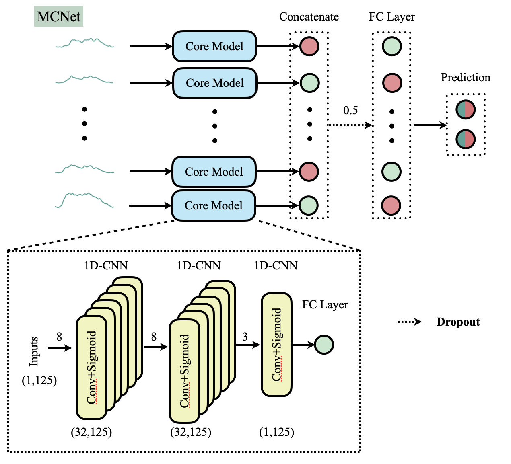

# MCNet v 0.1.0

## Description
This repo provides implementation of the code for the paper "Interpretable deep learning model for major depressive disorder assessment based on functional near-infrared spectroscopy".



## Packages

```

```